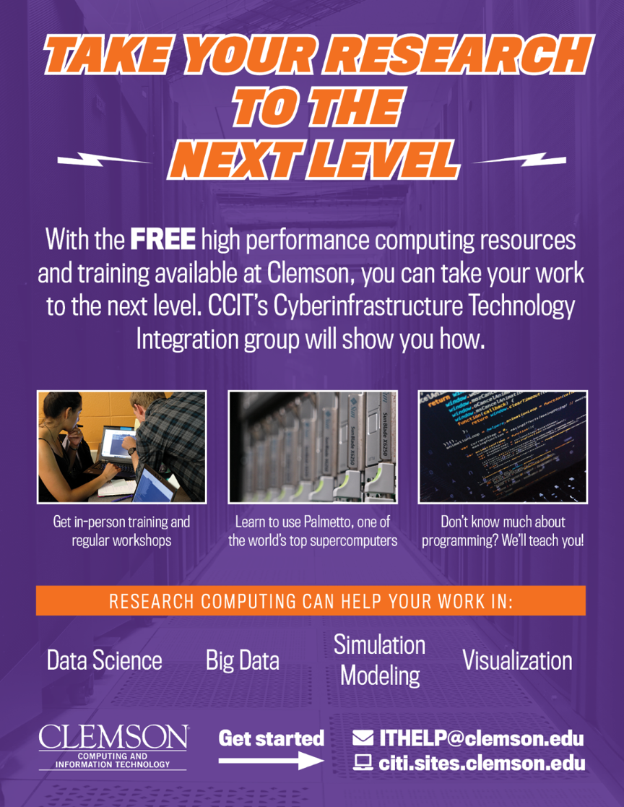

Palmetto is a *supercomputing cluster*: a set of powerful computers that are connected to each other. It is built and maintained by Clemson University, and is located off campus, close to Anderson SC, in a dedicated building which is powered by a dedicated power plant. 

Currently, the Palmetto cluster is ranked at #392 in the list of the world's most powerful computers (#9 among the United States' universities). 

The Palmetto cluster is maintained by two teams: a team of *system administrators*, who work directly at the cluster, and monitors its hardware and operating system, and a team of *research facilitators*, who work with the Palmetto users. The two teams work very closely together. As research facilitators, we provide training workshops, online help and support, and in-person office hours (which are currently on Zoom).

We maintain a [very extensive website](https://www.palmetto.clemson.edu/palmetto/) which hosts plenty of information for Palmetto users. We have ~1,800 people using Palmetto; they come from a variety of departments: Computer Science, Chemistry, Biology, Public Health, Engineering, Mathematics, Psychology, Forestry, etc. Palmetto accounts are free for Clemson faculty, staff, and students. Clemson faculty can buy priority access to the compute nodes, which will also give access to their collaborators outside Clemson. Students can get an educational account (which expires at the end of the semester) or a research account (which expires after they graduate). 



