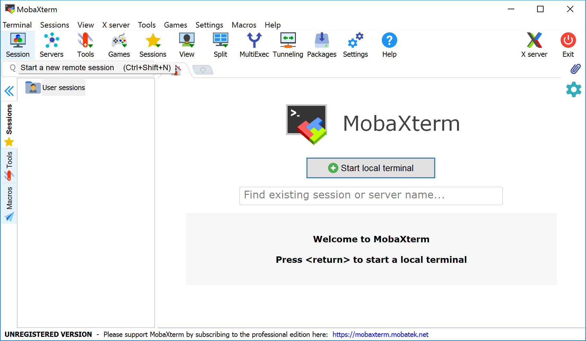
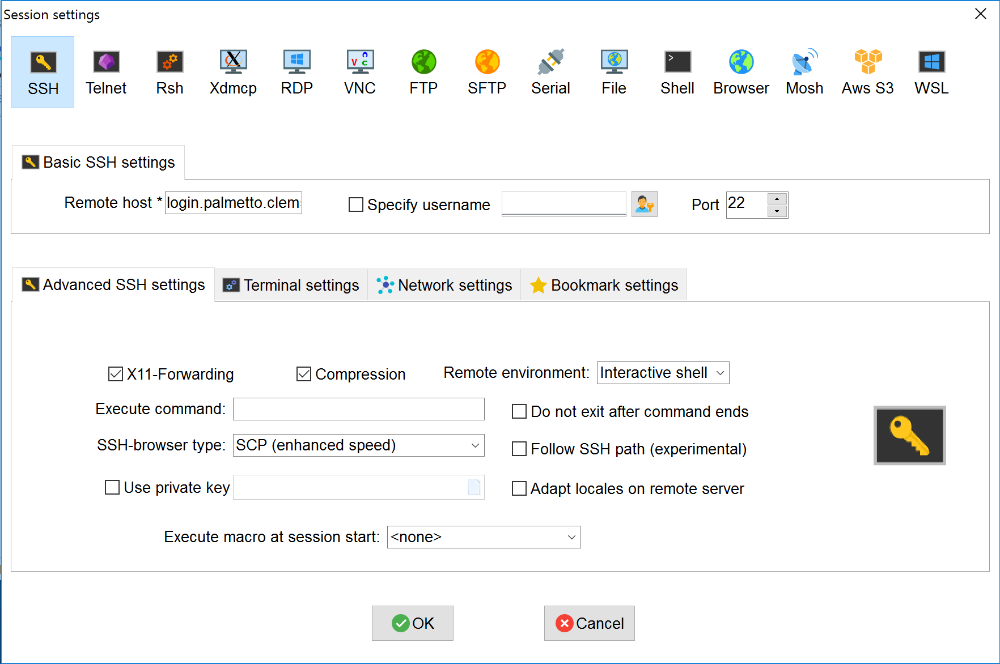
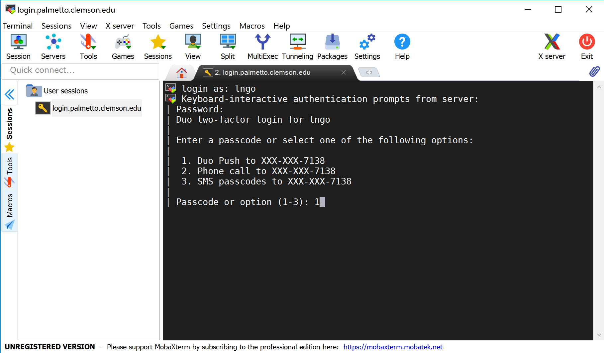
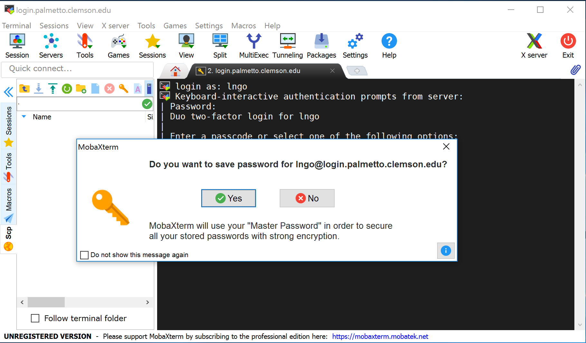
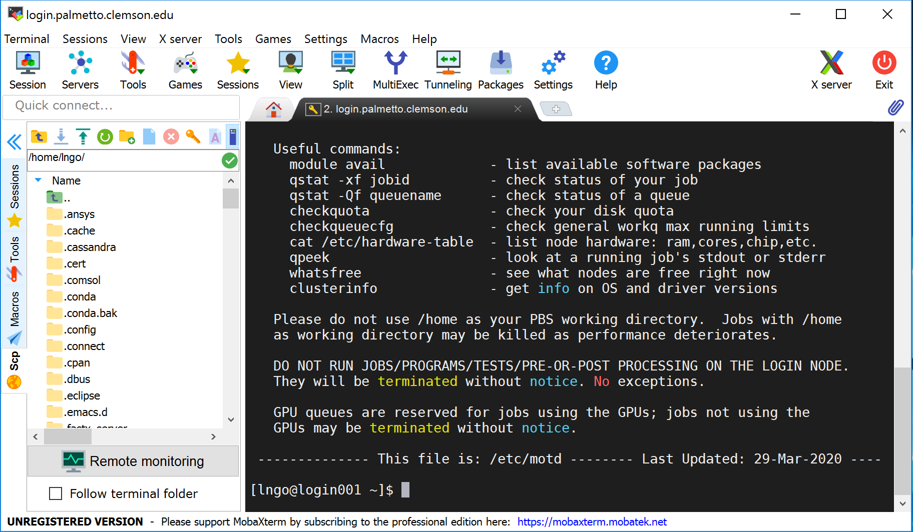

In this workshop,
we will use a command-line interface to interact with
the Palmetto cluster, which runs the Linux operating system
specifically, [CentOS](https://www.centos.org/).
However, note that these commands can be used on
any *Unix-based* operating system,
including Mac OS X.

To be able to run commands on the Palmetto from your own machine,
you will first need to be able to log in to the Palmetto.
This is known as a *remote login*.

For Mac OS X, you can open the Terminal Application and run the following:

~~~
$ ssh login.palmetto.clemson.edu
~~~
{: .bash}

For Windows, first you need to download and install
[MobaXterm Home Edition](https://mobaxterm.mobatek.net/download.html).

> It is important that you unzip the downloaded installer prior to installation.
> The zipped installer file contains an additional data file besides the installer
> executable. This data file is not accessible if the installer executable is
> called from insize the zipped file (something Windows allows you to do).
{: .callout}

After MobaXterm starts, click the `Session` button.

Select SSH session and use the following parameters (whichever required), then click `OK`:

* Remote host: `login.palmetto.clemson.edu`
* SSH-browser type: Enhanced SCP
* Port: 22

At this stage, for both Mac and Windows, you will be asked to enter your username
and password, then DUO option.

> For MobaXterm, please select No when asked if you want to save your password.
> 
{: .callout}

When logged in,
you are presented with a welcome message
and the following "prompt":

~~~
[username@login001 ~]$
~~~
{: .bash}

The prompt in a bash shell usually
consists of a dollar (`$`) sign,
and shows that the shell is waiting for input.
The prompt may also contain other information:
this prompt tells you `your username` and which node
you are connected to -
`login001` is the "login" node.
It also tells you your current directory,
i.e., `~`, which, as you will learn shortly,
is short for your *home* directory.
We will mostly refer to the prompt as just `$`, i.e.,

~~~
$
~~~
{: .bash}

In the figure below, MobaXterm also gives you a GUI browser of your home
directory on Palmetto. For Mac OS and Linux terminal, you will only have the
command line interface (CLI) to the right.

## Basic structure of the cluster

The Palmetto cluster has several "compute" nodes
that can perform fast calculations on large amounts of data.
It also has a few so-called "service" nodes,
that are *not* meant for this purpose.
Instead, they are meant to help users perform other actions
such as transfering code and data to and from the cluster.

The most important of these "service" nodes is
the login node `user001`.
The login node runs a "server" program
that listens for remote logins.
On our own machines, we run a "client" program
(Secure Shell or `ssh`) that can talk to this server.
Our client program passes our login credentials to this server,
and if we are allowed to log in,
the server runs a shell for us on the computer
it is running on (`user0001`).
Any commands that we enter into this shell
are executed not by our own machines,
but by `user0001`.
