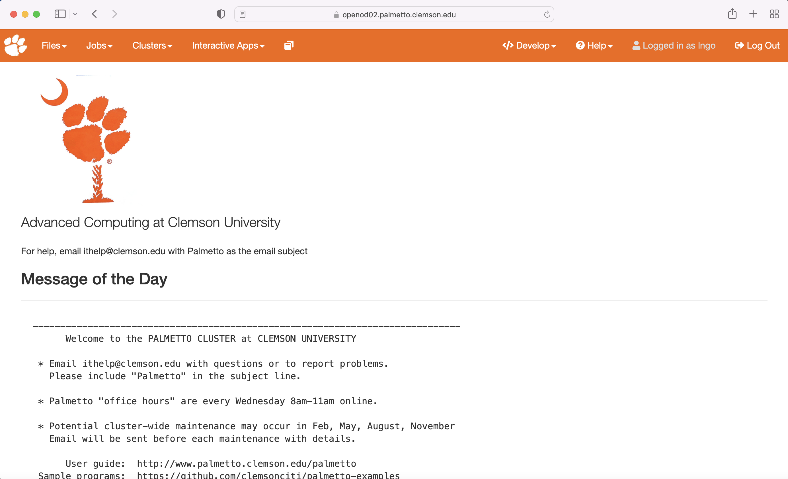

There are several ways to access the Palmetto cluster. Perhaps the easiest is through a web interface called Open On Demand. To start it, open a web browser, and go to this website:

```
https://openod.palmetto.clemson.edu
```

You will need to login with your Clemson username and password, and perform a DUO check. 



One convenient feature of Open OnDemand is a file browser. In the top left corner, you will see the "Files" button, which will take you to your home diretory or to scratch directory. Click it and explore the files in your file system. You can use this feature to view, edit, and delete files. It is also a convenient way to upload and download the files. You can go to any folder that you have access to by clicking "Go to". Try to upload any file inside your home directory.

The file browser on OpenOD is very user-friendly, but it is limited to files that are smaller than 100 MB. Later in this workshop, we will talk about transferring larger files. 

Another useful feature of Open OD is the terminal. You can enter any commands, and they will be executed on Palmetto. To start the terminal, click on `Clusters`, then `Palmetto Shell Access`:


Enter your account password and do the two-factor identification. This will bring you to the login node of Palmetto:


