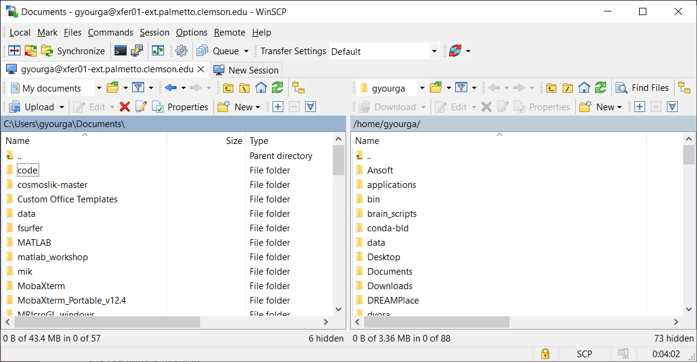

## Windows machines

### using MobaXTerm

For small file transfers, the Windows users can use the built-in function in MobaXTerm. On the left side of the MobaXTerm window, you will see the browser of your Palmetto directory. By default, it points to your home directory: `/home/<your Palmetto username>`. You can point it to any other folder that you have access to, for example, to `/scratch1/<your Palmetto username>`. To upload files *to* Palmetto, use the UP arrow, and to download files *from* Palmetto, use the DOWN arrow.

### using WinSCP

For more substantial file transfers, you can use an SCP client, such as WinSCP. You can download it [here](https://winscp.net/eng/download.php). Start it, then click on "New Site", and enter the following information:

- File protocol: SCP
- Host name: xfer01-ext.palmetto.clemson.edu

You can also specify your Palmetto username and Password. You can click `Save` to save this information. Click on Login, and do the two-factor identification. Note that we connect to Palmetto via `xfer01-ext` rather than `login`. `xfer01-ext` is a special Palmetto node that handles file transfers with computers that are outside of the Palmetto cluster, so it doesn't burden the login node.

If you log in sucessfully, you will see the files on your local machine on the left, and the Palmetto files on the right:

WinSCP has an interface that is intuitive and easy to use. To upload or download files or folders, right-click and select `Upload` (on your local machine) or `Download` (on Palmetto). To enter afolder, simply click on it; to exit it, click on the `..` in the beginning of the file list.  

## Mac and Linux machines

For Mac and Linux machines, we recommend a program called FileZilla. You can download it [here](https://filezilla-project.org/download.php?platform=osx).

Open, it, then click `Start` --> `Sie Manager`. Enter the following information:

- File protocol: SFTP
- Host name: xfer01-ext.palmetto.clemson.edu
- Port: 22
- Logon Type: Interactive
- User: <your Palmetto username>
  
  Then click `Connect`. It will ask you for your password. Then, it will do the two-factor identification (select `1` if you want to do DUO, etc). After that, you should see the following screen:
  
  

filezilla
scp
globus
