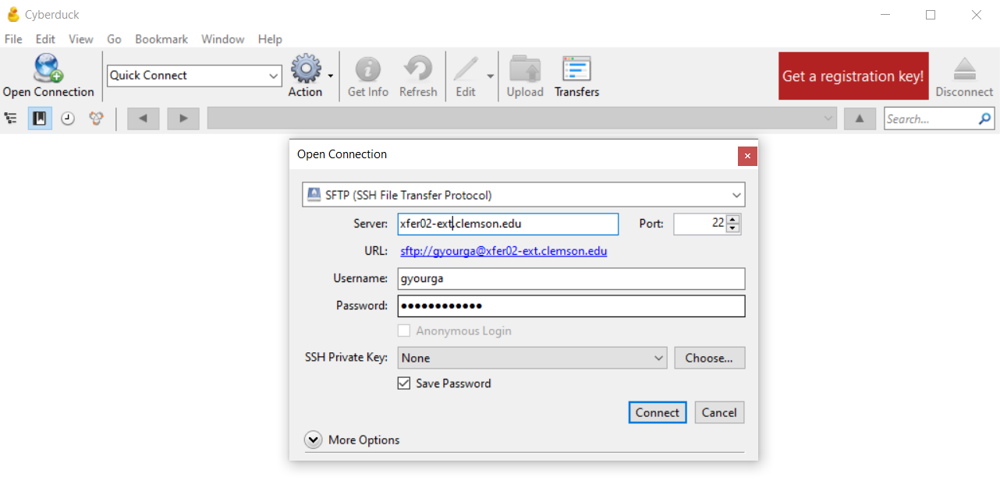

## CyberDuck

There are many ways to transfer files between your local computer and Palmetto. One piece of software that works for both Mac and Windows machines is called CyberDuck. You can download it [here](https://cyberduck.io/download/).

After installation, click on "Open Connection". A new window will pop out:

Let's configure the connection:
- in the drop-down menu on top, select "SFTP" instead of the default "FTP";
- in the "Server", please specify `xfer01-ext.palmetto.clemson.edu`;
- make sure that Port is set to 22;
- specify your Palmetto username and password.

Then, click on "Connect". Another window will pop out asking you to do two-factor verification:

Type "1" (the number one) or the word "push" if you want to get a DUO push notification. After two-factor verification, a yet another new window will pop up, which will contain the contents of your Palmetto home directory (if this is your first time using Palmetto, it will be empty). You can go to any other folder on Palmetto by changing the path (e.g., `/scratch1/username`). You can upload files by clicking the "Upload" button, and download files by right-clicking them and selecting "Download".

## MobaXTerm (Windows users only)

For small file transfers, the Windows users can use the built-in function in MobaXTerm. On the left side of the MobaXTerm window, you will see the browser of your Palmetto directory. By default, it points to your home directory: `/home/<your Palmetto username>`. You can point it to any other folder that you have access to, for example, to `/scratch1/<your Palmetto username>`. To upload files *to* Palmetto, use the UP arrow &uarr;, and to download files *from* Palmetto, use the DOWN arrow &darr;.

## command line (Mac and Linux users)

Another option for advanced Mac and Linux users is to use the `scp` command from the terminal. Open a new terminal, but **don't connect to Palmetto**. The `scp` command works like this:

~~~
scp <path_to_source> username@xfer01-ext.palmetto.clemson.edu:<path_to_destination>
~~~
{: .bash}

For example, here is the `scp` command to copy a file from the current directory on my local machine to my home directory on Palmetto (`gyourga` is my Palmetto username: 

~~~
scp myfile.txt gyourga@xfer01-ext.palmetto.clemson.edu:/home/gyourga/
~~~
{: .bash}

... and to do the same in reverse, i.e., copy from Palmetto to my local machine:

~~~
scp gyourga@xfer01-ext.palmetto.clemson.edu:/home/gyourga/myfile.txt .
~~~
{: .bash}

The . represents the working directory on the local machine.

To copy entire folders, include the -r switch:

~~~
scp -r myfolder gyourga@xfer01-ext.palmetto.clemson.edu:/home/gyourga/
~~~
{: .bash}

### transferring large amounts of data

If you need to transfer several gigabytes of data, and you find WinSCP / FileZilla too slow, you can use Globus. The interface is not as intuitive, but the file transfer speeds are much higher. [The guide to using Globus is on our website](https://www.palmetto.clemson.edu/palmetto/basic/started/#transfer-large-files-using-globus).

