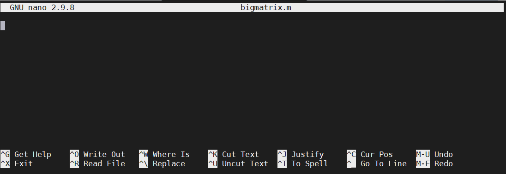
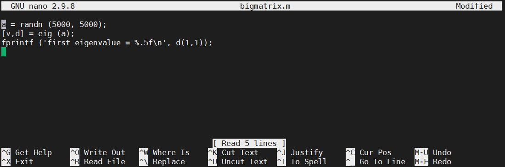

Interactive jobs are great if you need to do something quick, or perhaps visualize some data. If you have some code which runs for seven hours, interactive jobs are not a great idea. Please keep in mind that an interactive job gets killed if you close the SSH connetion. So for example, you connect to Palmetto from your laptop, start an interactive job, but then your laptop runs out of battery power and you can't find your charger. SSH client quits, and your interactive job is killed. 

If you have some truly serious, multi-hour computation project (and that's what Palmetto is really good for), a better idea is to run it on the background. This is called a *batch job*. You submit it in a fashin which is conceptually similar to an interactive job, but then it runs on the compute node on the background until it's over. If it needs to take two days, it takes two days. You can quit the SSH client or close your laptop, it won't affect the batch job.

To submit a batch job, we usually create a separate file called a *PBS script*. This file asks the scheduler for specific resources, and then specifies the actions that will be done once we get on a compute node. 

Let us go through an example. We will use bath mode to compute the first eigenvalue of a large matrix. We will create two scripts: a Matlab script which does the cmputation, and a PBS script which will execute the Matlab script on a compute node in batch mode.

Palmetto has a simple text editor which is called `nano`. It doesn't offer any fancy formatting, but it suffices for ceating and editing simple texts. Let's create the Matlab script first:

~~~
nano bigmatrix.m
~~~
{: .bash}

This will open the `nano` text editor:

Inside the editor, type this:
~~~
a = randn (5000, 5000);
[v,d] = eig (a); (
fprintf ('first eigenvalue = %.5f\n', d(1,1));
~~~
Instead of typing, you can copy the text from the Web browser and paste it into `nano`. Windows users can paste with `Shift`+`Ins` (or by right-clicking the mouse). Mac users can paste with `Cmd`+`V`. At the end, your screen should look like this:

To save it, press `Ctrl`+`O`, and hit enter. To exit the editor, press `Ctrl`+`X`. To make sure the text is saved properly, print it on screen usong the `cat` command:

~~~
cat bigmatrix.m
~~~
{: .bash}

Now, let's create the PBS script:

~~~
nano bigmatrix.sh
~~~
{: .bash}

Inside the `nano` text editor, type this (or paste from the Web browser):

~~~
#!/bin/bash
#
#PBS -N bigmatrix
#PBS -l select=1:ncpus=10:mem=10gb
#PBS -l walltime=0:30:00
#PBS -o output.txt
#PBS -j oe

module load matlab/2020a
matlab < bigmatrix.m
~~~

Let's go through the script, line by line. The first cryptic line says that it's a script that is executed by the Linux shell. The next line is empty, followed by five lines that are the instructions to the scheduler (they start with `#PBS`):

- `-N` speiies the name of the job (could be anything, I called it `bigmatrix` for the sake of consistency)
- the first `-l` line is the specification of resources: one node, ten CPUs, ten Gb of RAM
- the second `-l` line is the amount of walltime (thirty minutes);
- `-o` specifies the name of the output file where the Matlab output will be printed;
- `-j oe` means "join outout and error", which is, if any errors happen, they will be written into `output.txt`.

The rest is the instructions what to do once we get on the compute node that satisfies the request we provided in `-l`: load the MAtlab module, and execute the Matlab script called bigmatrix.m that we have created. Save the PBS script and exit `nano` (`Ctrl`+`O`, `ENTER`, `Ctrl`+`X`). 

Now, let's submit our batch job!

~~~
qsub bigmatrix.sh
~~~
{: .bash}

We use the same command `qsub` that we have previously used for an interactive job, but now it's much simpler, because all the hard work went into creating the PBS shell script `bigmatrix.sh` and `qsub` reads all the necessary information from there. If the submission was successful, it will give you the job ID, for example:

~~~
632585.pbs02
~~~
{: .output}

We can monitor the job's progress with the `qstat` command. This is an example to list all jobs that are currently executed by you:

~~~
qstat -u <your Palmetto username>
~~~
{: .bash}

You should see something like this:

~~~
pbs02:
                                                            Req'd  Req'd   Elap
Job ID          Username Queue    Jobname    SessID NDS TSK Memory Time  S Time
--------------- -------- -------- ---------- ------ --- --- ------ ----- - -----
632585.pbs02    gyourga  c1_sing* bigmatrix  24385*   1  10   10gb 00:30 R 00:00
~~~
{: .output}

You see the job ID, your Palmetto username, the name of the queue (nore on that later), the name of the job (`bigmatrix`), the resources requested (1 node, 10 CPUs, 10 gb of RAM, half an hour of walltime). The letter `R` means that the job is running (`Q` means "queued", and `F` means "finished"), and then it shows for how long it's been running (it basically just started).

Wait a little bit and do `qstat` again (you can hit the `UP` arrow to show the previous command). `Elap time` should now be a bit longer. The sript should take five minutes or so to execute. If you enter `qstat -u <your Palmetto username>` and the list is empty, then congratulations, we are done!

If everything went well, you should now see the file `output.txt`. Let's print it on screen:

~~~
cat output.txt
~~~
{: .bash}

~~~
MATLAB is selecting SOFTWARE OPENGL rendering.

                            < M A T L A B (R) >
                  Copyright 1984-2020 The MathWorks, Inc.
              R2020a Update 1 (9.8.0.1359463) 64-bit (glnxa64)
                               April 9, 2020

To get started, type doc.
For product information, visit www.mathworks.com.

>> >> >> first eigenvalue = -64.79945
~~~
{: .output}

Your first eigenvalue might be different because it's a random matrix.

Another way to use `qstat` is to list the information about a particular job. Here, instead of `-u`, we use the `-xf` option, followed by the Job ID:

~~~
qstat -xf 632585
~~~
{: .bash}

This will give you a lot of indormation about the jib, which is really useful for debugging. If you have a problem and you need our help, it is very helpful to us if you provide the job ID so we can do `qstat -xf` on it and get the job details.

How many jobs can you run at the same time? It depends on how much resources you ask for. If each job asks for a small amount of resources, you can do a large amount of jobs simultaneously. If each job needs a large amount of resources, only a few of them can be running simultaneously, and the rest of them will be waiting in the queue until the jobs that are running are completed. This is a way to ensure that Palmetto is used fairly.

These limits of the number of simultaneous jobs is not carved in stone, but it changes depending on how much Palmetto is used at the moment. To see the current queue configuration, you can execute this command (note that it only works on the login node):

~~~
checkqueuecfg
~~~
{: .bash}

You will see something like this:
~~~
1G QUEUES     min_cores_per_job  max_cores_per_job   max_mem_per_queue  max_jobs_per_queue   max_walltime
c1_solo                       1                  1              5000gb                 500      168:00:00
c1_single                     2                 24             36000gb                 300      168:00:00
c1_tiny                      25                128             25600gb                  25      168:00:00
c1_small                    129                512              8192gb                   2      168:00:00
c1_medium                   513               2048             32768gb                   2      168:00:00
c1_large                   2049               4096                 0gb                   0      168:00:00

IB QUEUES     min_cores_per_job  max_cores_per_job   max_mem_per_queue  max_jobs_per_queue   max_walltime
c2_single                     1                 40              6000gb                  15       72:00:00
c2_tiny                      41                200             16000gb                   5       72:00:00
c2_small                    201                512              6144gb                   1       72:00:00
c2_medium                   513               2048             16384gb                   1       72:00:00
c2_large                   2049               4096                 0gb                   0       72:00:00

GPU QUEUES     min_gpus_per_job   max_gpus_per_job  min_cores_per_job  max_cores_per_job   max_mem_per_queue  max_jobs_per_queue   max_walltime
gpu_small                     1                  4                  1                 96              4320gb                  15       72:00:00
gpu_medium                    5                 16                  1                256              6144gb                   4       72:00:00
gpu_large                    17                256                  1               2048             12288gb                   2       72:00:00

VGPU QUEUES   min_vgpus_per_job  max_vgpus_per_job  min_cores_per_job  max_cores_per_job   max_mem_per_queue  max_jobs_per_queue   max_walltime
vgpu_small                    1                  1                  1                  4               320gb                  10       72:00:00

SMP QUEUE     min_cores  max_cores   max_jobs   max_walltime
bigmem                1         80          5      168:00:00

   'max_mem' is the maximum amount of memory all your jobs in this queue can
   consume at any one time.  For example, if the max_mem for the solo queue
   is 4000gb, and your solo jobs each need 10gb, then you can run a
   maximum number of 4000/10 = 400 jobs in the solo queue, even though the
   current max_jobs setting for the solo queue may be set higher than 400.

   NOTE:  Although you may be within the limits for a queue, there may not
          be any resources of the type you are requesting currently available.
~~~
{: .output}

One thing to note is that 1g nodes have maximum walltime of 168 hours (seven days), and InfiniBand nodes have maximum walltime of 72 hours (three days). Since the GPUs are ony istalled on the InfiniBand nodes, any job that asks for a GPU will alse be subject to 72-hour limit. The maximum number of simultaneous jobs really depends on how much CPUs and memory you are asking; for example, for 1 node, 10 CPUs and 10 Gb of RAM (what we asked for in our `bigmatrix` job), we can run 300 jobs on 1g nodes (queue name `c1_single`), but only 15 jobs on InfiniBand nodes (queue name `c2_single`). If your request is modest, the scheduler will try to assign you to a 1g node first, and only if all the 1g nodes are busy, it will try to put you into a InfiniBand node.
