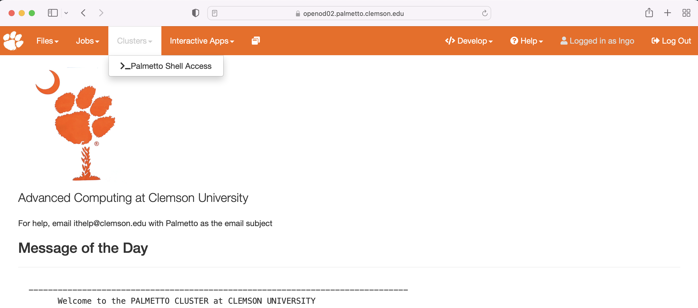

For this workshop, we will utilize Palmetto's new browser-based interface. 
This interface includes a directory navigation interface and a browser-based terminal. 

## OpenOnDemand Interface

Visit the following URL from your browser: 

```
https://openod02.palmetto.clemson.edu
```

You will need to login with your Clemson username and password, and perform a DUO check. 


On the top menu bar, click on `Clusters`, then `Palmetto Shell Access`



Enter your account password, then DUO information to log in to the browser-based terminal


When logged in,
you are presented with a welcome message
and the following "prompt":

~~~
[username@login001 ~]$
~~~
{: .bash}

