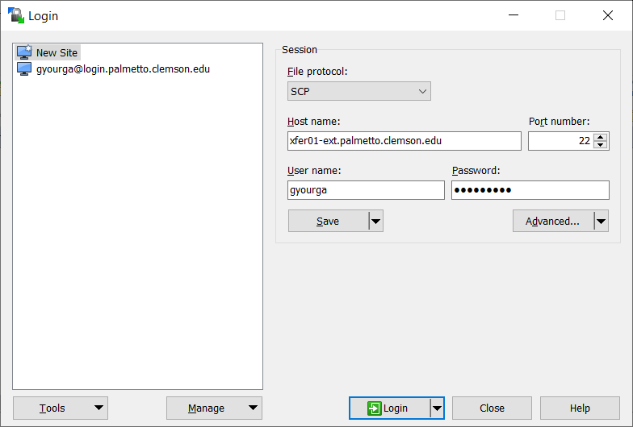

## Windows machines

### using MobaXTerm

For small file transfers, the Windows users can use the built-in function in MobaXTerm. On the left side of the MobaXTerm window, you will see the browser of your Palmetto directory. By default, it points to your home directory: `/home/<your Palmetto username>`. You can point it to any other folder that you have access to, for example, to `/scratch1/<your Palmetto username>`. To upload files *to* Palmetto, use the UP arrow &uarr;, and to download files *from* Palmetto, use the DOWN arrow &darr;.

### using WinSCP

For more substantial file transfers, you can use an SCP client, such as WinSCP. You can download it [here](https://winscp.net/eng/download.php). Start it, then click on "New Site", and enter the following information:

- File protocol: SCP
- Host name: xfer01-ext.palmetto.clemson.edu
- Port number: 22

You can also specify your Palmetto username and Password. You can click `Save` to save this information. Click on Login, and do the two-factor identification. Note that we connect to Palmetto via `xfer01-ext` rather than `login`. `xfer01-ext` is a special Palmetto node that handles file transfers with computers that are outside of the Palmetto cluster, so it doesn't burden the login node.

If you log in successfully, you will see the files on your local machine on the left, and the Palmetto files on the right:

WinSCP has an interface that is intuitive and easy to use. To upload or download files or folders, right-click and select `Upload` (on your local machine) or `Download` (on Palmetto). To enter a folder, simply click on it; to exit it, click on the `..` in the beginning of the file list.  

## Mac and Linux machines

For Mac and Linux machines, we recommend a program called FileZilla. You can download it [here](https://filezilla-project.org/download.php?platform=osx).

Open, it, then click `Start` --> `Site Manager`. Enter the following information:

- File protocol: SFTP
- Host name: xfer01-ext.palmetto.clemson.edu
- Port: 22
- Logon Type: Interactive
- User: <your Palmetto username>

Then click `Connect`. It will ask you for your password. Then, it will do the two-factor identification (select `1` if you want to do DUO, etc). After that, you should see the following screen:
  

  
The interface is very similar to WinSCP: the left part of the screen shows the files on your local machine, and the right part shows the files on Palmetto. Navigation between folders is the same (double click on the folder to enter it, click on `..` to exit the folder). You can also specify the direct path (currently, it's pointing to my home directory on Palmetto: `/home/gyourga`). Also, to my knowledge, `Quickconnect` option on the top of the window doesn't work on Palmetto because it cannot handle two-factor identification that Palmetto uses. 

Another option for advanced Mac and Linux users is to use the `scp` command from the terminal. It is [documented on our website](https://www.palmetto.clemson.edu/palmetto/basic/started/#direct-transfer).

### transferring large amounts of data

If you need to transfer several gigabytes of data, and you find WinSCP / FileZilla too slow, you can use Globus. The interface is not as intuitive, but the file transfer speeds are much higher. [The guide to using Globus is on our website](https://www.palmetto.clemson.edu/palmetto/basic/started/#transfer-large-files-using-globus).

